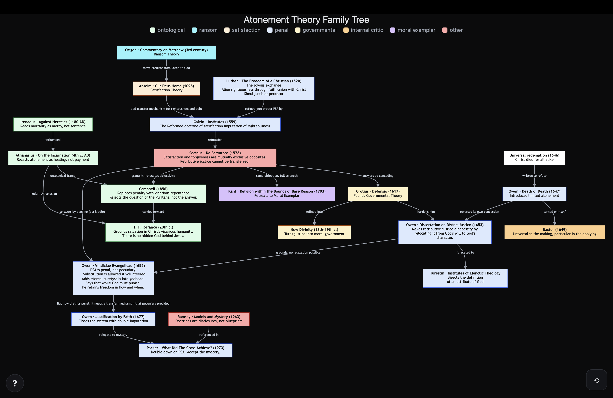

*This is the full argument. If you'd rather start with the fifteen-minute
version, [read the short essay first](../start/).*

## The argument

Penal substitutionary atonement (PSA) requires **a constraint on God that did not exist before the fall** — a necessity God acquires when the creature sins. Before there is guilt, nothing obliges God to punish. After there is guilt, he cannot do otherwise. In the God of classical theism that is a foreign object, incompatible with pure act, simplicity, and immutability.

And it has nowhere to sit. Housed outside God, it insults his sovereignty: something that is not God now binds God. Housed inside him, it damages his nature: an attribute that is essential yet has no object until a creature sins is an unrealised capacity in a being who is supposed to have none. Every available location offends one side or the other, and the pressure is not symmetrical. Sovereignty objections arrive immediately and always push inward; objections from the doctrine of God bite only once the constraint is already deep inside, which means they arrive late and against a position already adopted. Over time this constraint grows ever smaller until, in 1973, it just goes *poof* (more on that later). So the constraint migrates, and it migrates one way.

Seventeen centuries of that migration end in failure, for a reason that can be stated precisely: every move operates on the *modality* of the constraint — whether the "must" is absolute or hypothetical, whether it sits in the will or the essence — while leaving its *object* untouched. In every location the object is creaturely. The defect was always in the object.

The history of PSA is one of distribution and redistribution. Retributive justice gets disassembled and its pieces lodged in separate places, so that no single point in the system ever displays the whole contradiction at once. 

In this essay, the history of an embattled but influential doctrine is explored. Part one dates the apparatus. Part two follows the necessity alone, because that thread carries everything else. Part three reads the departures. Part four asks the further question — whether there was ever anything to house.

## Motive & Methodology

Before we begin, you have the right to know who I am, and how this essay was created.

### On Motivation
I have been a Christian in American evangelical spaces for over 40 years now. The gospel that was presented to me in my youth and young adulthood was always in the frame of penal substitution, and my intuition told me that something wasn't quite right in it. Nevertheless, I ignored my intuition for years due to the complexity of the problem. Many have rejected PSA on the basis that it just *feels wrong*. The typical complaint is that they "can't believe in a God who damns his creatures to hell". While I can resonate with the emotional reaction, the counterargument is hard to argue against: who are you to question God? 

Maybe it's a quirk of my personality, but that simply wasn't enough for me. Over time, the vibrancy of my faith started to fade, and eventually my struggle with the doctrine had created in me a crisis of faith and I began to consider myself to be a church-attending agnostic. 

This document is my systematic attempt to recover my faith.

### On Method 
**Full disclosure: I am an amateur theologian.** I have no official seminary training, and I don't have any masters of divinity on my resume. I came to this material as an interested amateur, and worked through it self-taught, from primary texts in translation and the secondary literature around them. My training is in software and systems design, and I haven't tried to disguise that this document is the result systems analysis pointed at theology. 

The actual design began with mapping out the various views, pinned to major streams or major documents in the history of theology, and the relationships between them. You can explore the map [here](https://davidmorton.github.io/atonement-theories/). After creating the map, I worked to understand each node's contribution - the thing it was trying to fix, and the new problems it created - and I added my notes to each. Finally, after having built the map and having entered my notes, I pointed Claude towards the map and asked it to identify patterns. What it identified is the subject of this essay. 

### On Assistance
The text in this document is is a combination of AI-generated text and manual edits. Much of the research was AI assisted. I, like you, am a finite being with a limited amount of time to devote to theological study, so I used the best tools at my disposal to help me get a comprehensive-enough grasp on the topic to be able to speak intelligently about it. 

**This does not mean it is not my own work.** My brain was involved throughout the process, not only in understanding the various positions, but also in questioning the AI assistant itself where I felt it was unclear or inaccurate. I used Anthropic's Claude Opus 4.8 for this research almost exclusively, and set the reasoning to high. The model just below Opus (Sonnet) was too error-prone and introduced too many confident (but wrong) assertions and speculations for my purposes. 

I researched every claim in the document as best as I could, using primary sources when possible. While I've done my best to identify and rectify any inaccuracies, it's almost certain that there are some remaining. The fault for that lies squarely on my shoulders. Nevertheless, I believe the general premise to be strong - the history of PSA is the history of a never-recognized bug introduced into a system, and how that bug impacts the supporting structures around it.

What follows is that story.

*David Morton, July 2026*

---

## Terms

**Retributive justice.** Punishment deserved because of what was done, proportioned to the offence, owed to the offender. It looks backward at the crime. Contrast **restorative justice**, which looks forward and aims at repairing the person and the relationship.

**Satisfaction.** Whatever must be rendered before the sinner can go free. The whole Western tradition after Anselm runs on this word, and fills it in two incompatible ways: for Anselm it is offered *instead of* the penalty, which is then never exacted; for PSA it is the penalty, exacted in full on a substitute. Both camps use the word; they do not use it for the same thing.

**Deontic vs. alethic.** *Deontic* is the "ought" family — duty, obligation, permission, desert. A *deontic property* is something like guilt, merit, debt, or righteousness: not a physical thing, but treated in these systems as though it can be owned, owed, transferred, or cancelled. *Alethic* is the "must" family — necessity, possibility, impossibility.

**Absolute vs. hypothetical necessity.** Absolute necessity means it could not have been otherwise, full stop. Hypothetical necessity (also called consequent or conditional) means it is necessary *given some earlier free choice* — once you have promised you must keep it, but you needn't have promised. These are the two settings on the modality dial, and the tradition turns that dial constantly.

**Acquired necessity.** A constraint on God whose *object comes into being with the creature*: God stands under it after the fall and did not stand under it before. This is independent of modality. An acquired necessity can be hypothetical (Anselm's honour, triggered by sin) or absolute (Owen's vindicatory justice, essential but with nothing to act on until there is guilt). "Consequent necessity" would be the natural name, but scholastic usage has already claimed that term for the benign category.

**Pure act** (*actus purus*). God has no unrealised potential — nothing in him is waiting to happen, nothing in him can be switched on later. It travels with **divine simplicity** (God is not assembled out of parts; his attributes are not components but identical with what he is) and **immutability** (God does not change). Hold these three together and you have the wall the tradition eventually runs into.

---

## Part one — the apparatus

### Retributive justice isn't one thing

To claim that a system takes retributive justice apart and hides the pieces, you have to say what the pieces are. Minimally, retribution needs five things:

1. **Desert** — guilt attaches to a particular person and merits a penalty.
2. **The guilt–penalty coupling** — the penalty must land on the one who deserves it. This is what makes it *retribution* rather than just harm.
3. **Proportion** — the penalty is matched to the offence. Too little and it's a hand-slap; too much and it's cruelty.
4. **Necessity** — it genuinely must be exacted. Something makes it unavoidable.
5. **Discharge** — once paid, the matter is closed.

Two more are needed to run any of this as a *transaction*:

6. **Currency** — what actually changes hands.
7. **Transfer device** — the mechanism by which it moves.

Track those seven across the history and you can watch the machine get built, strained, and abandoned.

### Reading the tables

- `·` — not present in this system at all
- `—` — not applicable, because the position denies the framework the row presupposes
- plain text — carried over unchanged from the position to its left
- **bold** — invented, moved, or redefined here
- `A / B` — the item has been *bisected* into two halves
- `✕` — dropped, broken, or under direct attack
- *italic* — the seed: present before anyone had a use for it

Column order is derivational, not chronological. Origen predates Athanasius by a century; Athanasius sits first because he is the baseline, showing what the system looks like with almost none of the machinery installed.

### Table A — building the apparatus

| | Athanasius (4th c.) | Patristic ransom (Origen, 3rd c.) | Anselm (1098) | Calvin (1559) |
|---|---|---|---|---|
| **currency** | · no exchange | **whole souls** | **debt / honour** | **sin / penalty** |
| **desert** | · absent | **man, as property** | **man, as guilty** | man |
| **guilt–penalty coupling** | · n/a | · n/a | **loosened** | **re-welded by currency conversion** |
| **proportion** | · n/a | · no measure | **infinite merit** | **full wrath** |
| **necessity** | *God's truthfulness* | **the adversary's rights** | **God's honour** | **God's justice** |
| **discharge** | · n/a | **automatic** | automatic | automatic |
| **transfer device** | · union, not transfer | **purchase** | ✕ destroyed | **imputation** |

The ransom column is labelled by framework rather than by person. Origen is its clearest early exponent, but the developed doctrine of the adversary's *rights* is later — Gregory of Nyssa states it more sharply — and Origen's own restorative and universalist commitments sit awkwardly with the column's other entries. The column marks the arrival of the transactional frame, not a settled reading of Origen.

The Calvin transfer-device cell is bold for *moved*, not *invented*. Imputation is Melanchthon’s — *iustificare* read forensically, to be pronounced righteous rather than made so — worked out a generation earlier and in a different controversy. The penal turn conscripts it and reverses its direction: justification needed righteousness to travel from Christ to the sinner, and the penal turn needs guilt to travel the other way first. The same tool runs backwards without modification, which is part of why the slot got filled without anyone remarking that a new one had opened.

**Six of the seven slots start empty.** These aren't features the tradition inherited from scripture and then organised. They are apparatus it built, and each piece can be dated.

### Three inventions, and the penal one comes last

*Stage one — the transaction (patristic ransom).* Exchange, a liable party, a transfer device, automatic discharge. But both specifically *retributive* slots stay empty: no guilt–penalty coupling, no proportion. Ransom is a transaction without retribution.

*Stage two — the two-party deontic frame (Anselm).* Anselm removes the third party. There is no longer anyone outside God holding a claim; the transaction is between God and man alone. And the currency becomes explicitly deontic — honour and debt, properties the parties *have* rather than states they are *in*. This is the precedent PSA is built on.

Retribution proper still hasn't arrived, and by the criterion set out above it can't have: the guilt–penalty coupling is what makes retribution retribution rather than harm, and Anselm loosens it. He has to. Satisfaction, for him, must be *surplus* — something the giver does not already owe, since rendering what is owed discharges a duty and generates nothing extra. Christ, being sinless, owes no death. That is what makes his death available as satisfaction, and why it cannot also be the penalty: a penalty is owed, and what is owed cannot satisfy.

Which means the shared word hides opposite mechanisms. Anselm's satisfaction is what makes the penalty unnecessary, offered *instead of* punishment. PSA's satisfaction *is* the punishment, exacted in full and redirected onto a substitute. One averts, the other administers. The coupling follows: PSA must move guilt onto Christ before the penalty can justly land, and Anselm must not, since a guilty Christ would owe death and a debt owed cannot be surplus. Imputation completes the one mechanism and wrecks the other. Punishment survives in Anselm only as the disjunct not taken — *aut poena aut satisfactio* — the fate of those outside the satisfaction.

*Stage three — the penal turn (Calvin).* Calvin's move is usually described as swapping honour for justice, which undersells it. He **converts the currency from a gift into a penalty** — and that conversion re-welds the guilt–penalty tie by itself, since a penalty, unlike a gift, is owed by someone in particular. Which is the problem: the penalty has to land, and Christ is not the one who owes it. Only a device that moves the guilt first can make the landing licit.

**Which is why imputation exists.** Anselm doesn't fail to supply a transfer device; he breaks one. Moving the creditor from Satan to God voids the purchase model, since you can't buy something back from its own owner. But he doesn't *need* a replacement, because satisfaction is offered up rather than put on anyone, and the slot sits empty for 450 years without embarrassment. Calvin can't leave it empty: a penalty borne by a substitute requires a mechanism by which guilt gets onto the substitute and righteousness onto the sinner. The transfer device isn't a late invention that happened to arrive with Calvin. It is the entailment of the penal turn.

So the sequence runs: transaction (3rd c.) → deontic two-party frame (1098) → penal conversion and the transfer device it requires (1559). Three inventions across thirteen centuries, and the specifically *penal* piece — the one the theory is named for — is installed last.

**Automatic discharge is a fossil.** Ransom introduces it for an obvious reason: a purchase frees the captive, and the captor releases on receipt. Anselm destroys the captor — Cur Deus Homo I.7 leaves the devil with no just title and nothing owed him but punishment — yet the release mechanism survives the demolition intact, rides through Calvin, and is still load-bearing in Owen’s Death of Death before Owen has to kill it in the 1650s. Which means the double-payment argument for limited atonement — the signature Reformed doctrine, resting on the claim that the same debt cannot justly be exacted twice — keeps half of a picture whose other half it discarded. The quittance rule was intelligible only while there was an external captor to let go on receipt. Once the creditor and the offended party are the same, “the same debt cannot be exacted twice” stops being a rule of transaction and becomes a bare assertion about divine justice — one Anselm never supplied and the tradition never went back to argue for.

### Socinus, 1578

Everything after this point is written under pressure from one man.

Faustus Socinus pressed two blades at once. First: satisfaction and forgiveness are mutually exclusive opposites. If satisfaction is genuinely paid in full, the debt is *discharged*, not forgiven — so grace has vanished and God is simply collecting. Second: guilt, in relation to retributive justice, belongs to the offender alone, and cannot justly be signed over to an innocent substitute.

Stated as a disjunction, the first blade becomes the dilemma that governs everything after. Either God could have forgiven without payment, in which case the cross was not required and the whole apparatus is superfluous — the **mercy horn** — or the payment was exacted in full, in which case nothing was forgiven. Both horns are fatal to a doctrine that needs the cross to be both necessary and gracious.

He was heterodox on a great deal else, and it doesn't matter. The objection is clean, and every subsequent move in the penal tradition is a response to it.

---

## Part two — the necessity

### The conversion that starts it

The move that generates the problem passes so smoothly it usually goes unremarked.

The starting material is a *deontic* (what *ought* to happen) fact about the creature: **sin deserves punishment**. Nobody disputes it; desert is the one slot that never moves in seventeen centuries. 

What PSA needs, and what satisfaction theory needed before it, is an *alethic* (what *must* happen) fact about God: **God cannot leave sin unpunished**. Without that, the cross is optional.

That last word carries an assumption that holds only inside the satisfaction frame: that the cross is only valuable in that it discharges a debt. If that view is held, then removing the necessity leaves the cross nothing to do, which makes the whole apparatus of wrath, substitution and imputation decorative rather than structural. Refuse it, as the ontological accounts do, and the cross is not optional at all, because the penalty was never what made it necessary. The alethic fact is not what makes the cross matter. It's what makes it matter *penally*. 

Getting from the deontic fact to the alethic one is the entire problem: a claim about what a creature deserves has to become a claim about what God is unable to do. Make that conversion and you've placed a modal constraint on God whose object — guilt — didn't exist until the creature produced it.

What the tradition does from there is take the "must" and adjust *which kind it is* and *where it is housed*. What it never does is ask whether the conversion should have ever been made in the first place.

### Table B — under pressure

| | Socinus (1578) | Owen 1647 | Federal, c.1648 | Owen 1653 | Owen 1655 | Owen 1677 | Turretin 1679–85 | Packer 1973 |
|---|---|---|---|---|---|---|---|---|
| **currency** | ✕ | sin / penalty | sin / penalty | sin / penalty | sin / penalty | sin / penalty | sin / penalty | sin / penalty |
| **desert** | — | man | man | man | man | man | man | man |
| **guilt–penalty coupling** | ✕ | imputed | **representative headship** | rep. headship | **suretyship** | **union** | **licensed transfer** | **mystery** |
| **proportion** | — | **quantified** | quantified | quantified | **parity left open** | parity left open | **fixed by fiat** | **mystery** |
| **necessity** | ✕ | **God's free decree** | **the pact** | **the divine essence** | **essence / mode** | essence / mode | **habitus / actus** | **mystery** |
| **discharge** | ✕ | automatic | automatic | automatic | ✕ dropped | dropped | dropped | dropped |
| **transfer device** | ✕ | — | **covenant** | covenant | ✕ broken | **double imputation** | double imputation | **mystery** |

Two rows are worth staring at.

**Desert never moves.** From the ransom fathers to Packer, seventeen centuries, the liability sits on man and nobody ever proposes otherwise. Everything else gets relocated, subdivided, or abandoned. That's the first anchor.

**The transfer-device row rhymes at both ends.** Athanasius has union. Owen in 1677 lands on union. When double imputation gets accused of being a legal fiction — a verdict that declares you righteous without making you righteous — Owen's answer is to ground it in union with Christ. The terminal repair of the forensic system is borrowed from the ontological system it was increasingly replacing with theological machinery.

Of the seven rows, one drives all the others: *necessity*.

### The question it answers

Every cell in the necessity row answers the same question: **given that God wants to save, what stops him from simply saving?**

Not "why did Christ die," but "what is the obstacle, and where is it kept." Everything else in the system is machinery for satisfying whatever the obstacle turns out to be. Change the obstacle's address and the machinery has to be rebuilt — which is why necessity moves first and the other rows move afterward.

### Two axes, and only one of them ever moves

There are two independent things you can ask about any necessity in this system.

**The modality axis.** Where does the "must" get its force — is it absolute or hypothetical? This is what the tradition works on. Athanasius hypothetical, ransom absolute-but-external, Anselm hypothetical, Calvin unstated, Owen 1647 hypothetical, the pact hypothetical, Owen 1653 absolute, Turretin absolute-as-habit. The dial turns constantly.

**The object axis.** What does the constraint bear on, and did that object exist before the fall? Here nothing moves at all. In every cell, from Athanasius's forfeited word to Turretin's disposition awaiting exercise, the constraint has nothing to act on until man sins. Retributive justice is existentially dependent on guilt; take guilt away and it has no object. The pact is triggered by a foreseen fall. Honour is disordered by a creature's act. The divine decree Owen appeals to in 1647 concerns creatures.

**So there is a second anchor, and it is more damaging than the first.** Desert never leaves man, and the constraint's object is always creaturely. Everything else in seventeen centuries is furniture.

The inward migration is an attempt to fix the problem by **changing the modality** — pushing from hypothetical toward absolute, so that nothing outside God binds God. It is well motivated and pursued with real rigour. But Owen 1653's necessity is fully absolute and still acquired, because vindicatory justice has nothing to be about until there is guilt to punish. Turretin's *habitus* is fully essential and still acquired, for the same reason.

Translation, fission, evaporation — all three are operations on modality and location. **None of them touches what the constraint is about.** That is why the search space gets consumed in order rather than resolved: not bad luck, and not incompetence, but a thorough and systematic search of the wrong axis. 

Incidentally, this constant adjustment of the search space is what has given PSA its staying power. The sheer number of variations of the model make it extremely difficult to pin down because of the shape-shifty nature of how they're popularly conflated with each other. An adept defender of PSA almost intuitively knows how to defend by subtly shifting the presuppositions mid-conversation. This leaves the person questioning it sensing something is wrong but not quite knowing what. I don't think it's intentional on the part of the defender. They're trying to defend the value of the cross and their defense matches the defenses they've heard when they argued against it. Eventually, one just accepts it as a mystery (as Packer does) and assumes it's the only way it works. I was there myself.

### The squeeze

Underneath the necessity row, as the tradition understood it, runs a single trade-off:

> The further **out** the constraint sits, the safer God's nature is — and the more it looks like an insult to his sovereignty.
> 
> The further **in** it sits, the more sovereign God looks — and the more the constraint damages his nature.

The net pressure runs inward, because the two objections do not arrive on equal terms. *Nothing outside God may bind God* is available from the beginning and applies to every external location. Simplicity, immutability and pure act only bite once the constraint is already inside the divine nature, which means they arrive after the inward move has been made and must be answered from a position already occupied.

That asymmetry is the whole dynamic. It does not mean nobody pushed back. Twisse — prolocutor of the Westminster Assembly — argued in 1632 that God punishes sin by no necessity of nature but in virtue of a decree originating in a free act of his will, and Rutherford followed him in 1649. Thomas Gilbert, an admirer of Owen close enough to be commissioned to write his epitaph, published against Owen's position in 1665. The will-located option was live, orthodox, and held by people nobody could dismiss. It was rejected for a stated reason: the fear that a will-located necessity concedes the Socinian case. The wind blew both ways; the tradition chose its direction.

### Table C - The penal spine

The sequence running down it — everything that stays inside the satisfaction framework and keeps relocating the necessity rather than giving it up — is the **penal spine**. Part three deals with the positions that leave.

| Position | Regime | The move | Necessity sits in | Object of the constraint | Cost to the doctrine of God |
|---|---|---|---|---|---|
| **Athanasius**, 4th c. | *origin* | Sets the divine dilemma: God's goodness would redeem, but his truthfulness cannot let the sentence of death fall. | God's veracity — *hypothetical*, since the binding follows a free utterance | the creature's forfeit | none yet; the binding is self-imposed |
| **Patristic ransom**, 3rd c. | *origin* | Places the claim in another agent: the adversary holds title to human souls, so a price must be paid. | the adversary's rights — *absolute, but wholly outside God* | the creature's captivity | none to God's nature — but the adversary now has standing against God |
| **Anselm**, 1098 | **translation** | Denies the adversary any rights; removes the third party; re-seats the claim in God's honour and the rectitude of the created order. Establishes deontic properties as currency. | God's honour — *hypothetical*, triggered by the creature's sin | the creature's sin | divine freedom: the creature's act now generates an obligation |
| **Calvin**, 1559 | **translation** | Swaps a relational category for a proper attribute: justice, not honour, is what must be answered. Converts the currency from gift to penalty, requiring imputation. | God's justice — *modality left unstated* | the creature's guilt | latent; the bill is deferred |
| **Socinus**, 1578 | *pressure* | Forces the disjunction: if willed, God could have forgiven and the cross is superfluous; if absolute and exacted in full, the debt is discharged and nothing is forgiven. | — | — | the tradition must now say where necessity lives, and both answers cost something |
| **Owen**, 1647 | **translation** *(retrograde)* | Holds the Twisse–Rutherford line: necessity sits in the will, and the real constraint comes from arithmetic — the same debt can't justly be exacted twice. | God's free decree — *hypothetical* | the creature's debt | none directly, but the necessity is rented from a money model |
| **Federal / *pactum salutis***, c. 1648 | **translation** | Grounds the obligation in a pre-temporal covenant between Father and Son, with Christ as surety — standing as guarantor for another's debt. | an intra-trinitarian pact — *hypothetical*: freely made, then binding | the foreseen elect | trinitarian equality: God contracts with God |
| **Owen**, 1653 | **translation** *(terminal)* | Reverses his own earlier position. Declares vindicatory justice a natural, necessary attribute: God can no more leave sin unpunished than deny himself. | the divine essence — *absolute* | still the creature's guilt | pure act and immutability |
| **Owen**, 1655 | **fission** | Bisects the necessity: the *fact* of punishment is necessary, the *mode* — when, whom, how — is free. This is what licenses accepting a substitute. | essence (fact) + will (mode) — *absolute in fact, free in mode* | unchanged | simplicity: one attribute now runs under two modalities |
| **Turretin**, 1679–85 | **fission** | Bisects the attribute itself: *habitus*, the disposition, is necessary; *actus*, its exercise, is free. | inside a single attribute — *necessary as habit, free as act* | unchanged | pure act, now explicitly: a named potency |
| **Owen**, 1677 | *none* | Doesn't move the necessity at all; closes the forensic circuit with double imputation grounded in union with Christ. | unchanged | unchanged | trinitarian equality again: a transactional Father–Son distinction |
| **Packer**, 1973 | **evaporation** | Keeps the necessity but withdraws the mechanism from rational inspection: the model is a disclosure, not a blueprint. | mystery — *asserted, unspecified* | unstated, and the silence is telling | intelligibility itself |

Read the two location columns (**Necessity sits in** and **Object of the constaint**) against each other. The first is in constant motion for fifteen hundred years. The second never changes.

Four cells leave something behind that the next move has to deal with. Anselm's honour is waivable, so it fails to necessitate at all — and man's sin has acquired a lever. Calvin never says whether justice-must-punish is essential or willed, and that ambiguity is load-bearing: it is precisely what Socinus forces into the open. Owen's 1655 freedom over *mode* severs the guilt-penalty coupling that made the justice retributive in the first place, and accepting a substitute in order to restore the sinner quietly converts retribution into restoration. Turretin's disposition, necessarily present but only contingently exercised, is exactly the potency the move was meant to avoid; the split labels the problem instead of dissolving it.

### The three regimes

The regime column names what *kind* of operation is being performed, and the phases turn out to be strictly ordered.

**Translation** — the constraint is moved from one container to another. The adversary's rights, then God's honour, then justice, then his will, then a covenant, then his essence.

**Fission** — once the constraint reaches the divine essence there is nowhere further in to go, so the motion changes kind. The container itself starts splitting. Owen divides necessity into fact (as attributes) and mode (as will); Turretin takes the fact Owen just extracted and subdivides it further into disposition and exercise. There are more containers, but they keep getting smaller.

**Evaporation** — when division stops helping, the locus is emptied. Packer keeps the claim that satisfaction was necessary and declines to say what makes it so. The asymptote moves ever increasingly toward zero.

Reading down the column: two origins, five translations, two fissions, one evaporation. No fission happens before translation is exhausted; no translation happens after fission begins. That is not what a tradition wandering around looks like. It is what a search space being consumed in order looks like.

**Owen is the hinge, personally, and twice over.** He converts from the will-located position to the essence-located one in 1653, and performs the first fission two years later. The phase boundary of the entire tradition sits inside one man's working life. He didn't discover that necessity belonged in the divine essence and then discover it needed subdividing; he ran out of room and changed operations.

The 1647 cell is not drift. Owen originally held that satisfaction was not necessary for the forgiveness of sin, and the *Dissertation on Divine Justice* refutes in succession the Socinians, Twisse, and Rutherford — his own former party.[^owen] His stated motive is the point: he undertook the work lest the Socinians turn Twisse's arguments to their own purpose, arguments which, he notes, the Socinians acknowledged had drawn them toward their heresy. His judgment is that if the necessity sits in the will rather than the nature, Socinus wins. That is this argument's thesis with the sign reversed. The tradition's most rigorous defender agrees the location is load-bearing, and concluded it therefore had to go into the essence.

[^owen]: Owen, *A Dissertation on Divine Justice* (*Diatriba de Justitia Divina*, 1653), in *Works*, ed. Goold, vol. 10. On the change of mind and its polemical occasion, see Carl Trueman, "John Owen's *Dissertation on Divine Justice*: Scholasticism in Subservience to Theology." Twisse's argument is at *Vindiciae Gratiae Potestatis ac Providentiae Divinae* (Amsterdam, 1632) 1.25, digr. 8; Rutherford's in *Disputatio Scholastica de Divina Providentia* (Edinburgh, 1649). The Dissertation's title page names Twisse among the "very learned men" whose objections it answers.

One more regularity: **the necessity slot only goes slack when something else is temporarily carrying the weight.** Owen 1647 is the single retrograde move — necessity sits out in the divine will — and it happens precisely when the double-payment argument is doing the work instead. The moment Socinus knocks that prop out, necessity tightens and keeps tightening.

### Wall one — the doctrine of God

> If punishing sin is something God must do by his very nature, then before anyone had sinned there was something in him with nothing to do — a capacity idling, waiting for a creature to switch it on, in a God who is supposed to have no idling parts.

Push the necessity inward to protect God's sovereignty and you eventually reach his essence. But retributive justice is existentially dependent on guilt: take away guilt and it has nothing to do. So before the fall, this supposedly essential attribute has no object. An essential attribute with nothing on which to act is an unrealised capacity — a potency — in a being who is supposed to be pure act. And when the creature sins and the capacity switches on, that is a change in God.

**The standard reply.** A classical theist might respond: God's mercy has no object before creation either. Neither does his creative power, nor his knowledge of contingents. The tradition handles this with *extrinsic denomination* — the change is in the creature, not in God; God's attributes terminate in creatures without any real relation in God. On that account Turretin's *habitus/actus* split isn't an improvisation but standard machinery applied to a standard case, and the objection proves far too much: run it against vindicatory justice and you run it against every divine attribute that relates to creation at all.

The theist's reply is a good one, and the objection has to be sharpened to survive it. Two independent disanalogies do the work; either is sufficient.

**Disanalogy one: the direction of determination.** Creation runs one way. God acts; the creature exists in consequence. No creaturely state is the proximate cause of anything in God, and no creaturely state *compels* a divine response — nobody claims God must be merciful to this sinner rather than that one.

Retributive necessity runs the other way. Its whole content is that God *cannot* leave sin unpunished. The creature acts, independently of the divine act in the relevant sense, and God is now *compelled* to respond. That makes a creaturely state the sufficient condition for a divine action God is not free to withhold. Extrinsic denomination cannot absorb this, because the objection is no longer that God has an unexercised capacity — *it is that the creature holds a lever*. Mercy without an object is a capacity awaiting a fitting occasion. Vindicatory justice without an object is a demand awaiting a trigger, and the trigger is in the creature's hand.

**Disanalogy two: contrastive dependence.** Mercy and goodness are intelligible without creatures. The intra-trinitarian life gives goodness an eternal object; nothing about the concept requires a deficient recipient.

Retribution is not like this. It is contrastive in the way "cure" is contrastive: cure is not merely unexercised in a world without disease, it is *unintelligible* there. Retributive justice requires injustice in order to have any content at all. So locating it in the divine essence is not locating an attribute that happens to lack an occasion. It is locating in the essence of God a concept that cannot be specified without reference to a creaturely defect — a different and worse kind of dependence than anything extrinsic denomination was built to handle.

Put the two together and the acquired necessity is exposed: on this account, we broke God when we sinned. Not in the sense that we damaged him, but in the strict sense that a constraint came to bind him which did not bind him before, and its trigger was ours to pull.

**The manifestation dilemma.** There is a further cost, best pressed as a dilemma rather than an accusation.

*Actus purus* runs on the premise that an unrealised perfection is a defect — that God is fully actual precisely because nothing in him is waiting. Apply that premise to vindicatory justice, held to be an essential attribute, and ask what follows in a world with no sin.

Either its non-exercise is no defect, in which case it is hard to see why it counts as an essential perfection at all and Turretin's *habitus* is doing no work. Or its non-exercise *is* a defect, in which case a sinless creation is a world in which God is less fully manifest as what he is, and God therefore has reason to permit the fall for the sake of his own completeness.

The second horn is not an imputation. The supralapsarian line that God ordained the fall in order to display both mercy and justice is a stated position within the tradition, and Edwards is explicit that a full display of the divine attributes requires objects of both.[^edwards] The uncomfortable conclusion is theirs: on that account creation is instrumental to the exercise of an attribute, and the fall is instrumental to God's own manifestation.

[^edwards]: See Edwards, *Concerning the End for Which God Created the World*, on the communication and display of the fullness of the divine perfections. The supralapsarian version is older and appears in the standard *ordo decretorum* debates: the decree to permit the fall is subordinated to the decree to display mercy and justice on their respective objects. The argument does not depend on Edwards being read as a supralapsarian, only on the claim that a full manifestation of the divine attributes requires objects of both mercy and justice, which he makes.

And if the fall is decreed and the decree serves the display of an essential attribute, then God is the author of the condition that binds him, which makes the constraint self-imposed and therefore not a necessity at all — Socinus's mercy horn returns intact. Human responsibility for the fall also becomes difficult to state in any robust sense. This is a fork rather than a knockout: a defender can retreat to a merely permissive decree, or to middle knowledge, and the argument has to be fought on that ground instead. But both branches cost something, and the branch that best protects free will is the one that least supports the necessity.

### Wall two — the doctrine of the Trinity

> Once the debt is owed to God himself, the only parties left who can settle it are the persons of the Trinity — and between persons who share one essence, one will, and everything else, nothing can actually change hands.

This one follows from the same move and is less often noticed. Once the obligation is *internal* to God, the only parties left to transact are the divine persons. Hence the pre-temporal pact, hence eternal suretyship, hence Christ standing before the Father. But a transaction between co-equals is either vacuous — nothing can really change hands between persons who share one essence — or it is subordinating, because a genuine payment requires one party to gain what the other gives up.

**The standard reply** is that the *pactum* is between the Father and the Son *as Mediator*; that the obedience belongs to the assumed human nature; and that the order among the persons is economic rather than ontological, a *taxis* of mission rather than a hierarchy of being.

**Which forks rather than escapes.** Ask what pays.

If the Son pays *qua* human nature, the currency is human, and a finite nature cannot render infinite satisfaction — which is why the tradition reached for the infinite worth of the divine person in the first place. The reply that his humanity has infinite value *because* it is the humanity of the divine person concedes the point: the value is sourced in the divinity, and the payment is intra-divine after all.

If the Son pays *qua* divine, the payment is between persons who share one undivided essence, one will, and one set of goods. Nothing is transferred, because there is no state of affairs in which one person possesses what the other lacks.

And the economic-*taxis* defence has an empirical cost that is hard to wave off: the eternal functional subordination controversy is the pactum's logic surfacing under pressure. When theologians working inside this framework try to give the Son's eternal covenantal obedience real content, a subordination of some kind is what they arrive at. That is not speculation about where the logic leads; it is a record of where it led.

You can have an intelligible transaction or you can have trinitarian equality. Not both.

### What the walls cost

The framers were not sloppy. They were working hard to preserve exactly these commitments, and the moves are ingenious. But the two walls close in as the constraint moves inward, and every remaining move trades one for the other. Turretin buys sovereignty and pays in pure act. The covenant buys necessity and pays in trinitarian equality. Owen 1677 buys reality for imputation and pays by borrowing from the system PSA replaced. Packer buys peace and pays with the entire rational apparatus.

---

## Part three — leaving

Everyone who leaves PSA leaves by the same door. Whatever else divides them, every departure is an operation on the necessity slot.

| Position | Action | What becomes of the necessity |
|---|---|---|
| **Grotius**, 1617 | relaxation | Moves out of God and into the requirements of government. God is Ruler rather than creditor, and the penalty becomes relaxable. |
| **The New Divinity**, 18th–19th c. | dissolution | Redefined as benevolent rectitude — God's disposition to do what best serves the moral system. No retributive necessity remains to house. |
| **Socinus, Kant** | denial | Never granted in the first place. Nothing to locate. |
| **Campbell, Torrance** | evacuation | The slot is returned to empty. This is the Athanasian baseline restored — minus the divine dilemma that put the seed there. |

A jurist, a school of New England Calvinists, a Socinian and a Kantian, two Scots working from the Greek fathers. They differ on the person of Christ, on what the cross accomplishes, on the authority of scripture. Structurally they make one move four times: **stop trying to find somewhere to put the necessity.** Which is also why the arguments between them and PSA never resolve. They are not offering rival answers to the question "where does the necessity live." They are refusing the question.

Grotius belongs here rather than on the spine despite preceding every Owen entry, and the distinction is modal rather than directional: Anselm and Calvin relocate a necessity they continue to treat as binding, whereas Grotius makes it **relaxable**, which is a change in kind rather than in address.

**Packer is not a fifth exit.** The four above remove the *claim*, so having no location for it is perfectly coherent. Packer removes the *location* while keeping the claim. He still asserts that satisfaction was necessary; he simply declines to say what makes it so, on the grounds that the model is a disclosure rather than a blueprint.

His framework is more considered than the label suggests. Packer is doing philosophy of religious language: he adopts Ian Ramsey's models-and-qualifiers approach and argues that penal substitution is a controlled analogy which discloses something real about God without licensing us to press every joint of it. He also does substantial exegetical work — the engagement with C. H. Dodd over *hilastērion*, the word rendered "propitiation" or "expiation" at Romans 3:25, is a technical dispute about the term, not a retreat from the text.

The charge is narrower than "he stopped arguing." Of all the slots in the system, the one he declines to specify is the necessity — and that is the slot which, when specified, lands in the Godhead as a constraint incoherent before the fall. He cannot ground it in the sin of man without making the creature the author of a divine obligation. He cannot ground it in the essence without inheriting Wall One. Declining to say is the only remaining option that keeps the doctrine intact, which is why the silence falls exactly there and nowhere else. Read that way, the evaporation is not intellectual fatigue; it is an accurate assessment of the terrain.

There is a further awkwardness. Every position on the penal spine was built by classical logic, each framed as a correction of the last and argued on the premises of the previous move. Declaring the resulting doctrine exempt from logical inspection disowns the method that produced it. And the exemption is not extended evenly: the same lecture that asks for latitude on penal substitution presses Dodd hard on reducing propitiation to expiation.

---

## Part four — why there is nothing to house

Everything to this point is structural: the apparatus is unstable, the constraint has nowhere to live, and the search was conducted on the wrong axis. But that is compatible with retribution being real and the theories about it being bad. Something further is needed, or the conclusion doesn't follow.

The further claim is that a good and infinite God has no use for retribution — not because retribution is unjust, but because it is a *finite* form of justice, and its necessity in human hands is an artifact of what human hands cannot do.

**Restoration is justice proper.** Ask what justice actually requires in an ordinary case. A child takes another child's toy; justice is served when the toy goes back. Not when the taker suffers proportionally. The suffering, where we impose it, is doing a different job — deterrence, or the vindication of the wronged party's standing, or the public marking of the wrong. The restoration is what makes the situation *just*. Everything else is commentary on it.

**Retribution is a display of justice, adopted where restoration is unavailable.** Now take a case where the thing cannot be given back. A murder. There is no act available to anyone that restores what was taken, because we cannot raise the dead and cannot turn back time. Justice in the proper sense is off the table permanently. What remains is to *display* the justice we cannot perform: to mark, proportionally, that a wrong of this magnitude occurred, and to refuse to let it pass unmarked.

This is a real and serious thing to do, not a fiction. But notice what generates the need for it. **We reach for retribution exactly where restoration is impossible, and restoration is impossible because we are finite.** The irreversibility of the harm, the unrecoverable residue that no compensation reaches — these are not features of wrongdoing as such. They are features of wrongdoing *under the conditions of finitude*, where time runs one way and the dead stay dead.

**God is not under those conditions.** Restoration is never unavailable to him. The resurrection is not a workaround for justice; it is justice performed rather than displayed. If the thing taken can be given back — and for a God who raises the dead, it can — then the situation that makes retribution the only remaining option never arises. An infinite God reaching for a substitute for restoration is a God reaching for the tool that exists because we lack his capacities.

**Which means the necessity claim inverts the relation.** Owen's argument is that God's justice is so complete that it *cannot* let sin pass unpunished. But retributive necessity is not a mark of justice's completeness; it is a mark of justice's obstruction. In us it registers a limit — this cannot be put right, so it must at least be marked. To make that necessity essential to God is to write our limitation into his nature and call it a perfection.

This is the sense in which the foreign object is foreign. Not merely that the constraint has no coherent location, though it doesn't, but that the thing being housed is a finitude artifact. It belongs to the moral life of beings who run out of options. Installed in a being who never runs out of options, it can only sit there as an unexercised demand waiting for a creature to trigger it — which is precisely what every position in Table B was trying and failing to make sense of.

Two consequences.

**The retributive God is a smaller God than the restorative one.** The usual intuition runs the other way: strict justice looks like the demanding, serious position, and restoration looks like leniency. But strict retribution is what you fall back on when repair is beyond you. A God who *must* balance the books is a God for whom the alternative is closed. A God of infinite generative abundance does justice by making it right, and does so not reactively but out of what he has.

**And this is why the exits look alike.** What unites Grotius, the New Divinity, Socinus and Kant, Campbell and Torrance is that each, by a different route, stopped treating a finitude artifact as a divine attribute. Not four theories. Four ways of noticing the same thing.

---

## Conclusion: where do we go from here

It would be reckless to end this essay without providing an alternative. Dismantling penal substitution yet leaving the ground bare arguably damages more than the doctrine does, mostly because of who tends to be standing there.

Many people I know and love have abandoned their faith because of this doctrine. Not marginally, and not mainly among the careless — it survives untroubled in anyone who holds it at arm's length. It becomes unbearable precisely to the person who takes it seriously enough to feel it: who follows the transfer of guilt to its conclusion and asks what kind of Father requires the blood of his Son before he can look at his children without anger. That person is told to look at Jesus and see the Father, but when they do, they find someone unexpected standing behind Jesus — a hidden God with a prior demand, whose disposition toward them had to be purchased before it could be enjoyed. They came for comfort and healing and were handed a creditor. And they are, more often than not, the most morally serious people in the room. In contrast, the doctrine costs least to those who examine it least.

Many have loved God through this doctrine and been brought to Christ by it, and nothing here is aimed at them. But the wreckage is real, and it falls hardest on the tender, the scrupulous, and the ones who came in already wounded.

### What stands in its place

Athanasius already has a complete account, and it needs one repair. The divine dilemma of *De Incarnatione* 6–7 — where God's truthfulness is said to bind him to the sentence of death — is the single place he lodges a necessity in God, and it is the seed everything in this document has been tracing. Prune it, and take instead his own better line: death is what follows when a creature turns from the source of its life, as cold follows the removal of heat. Not a sentence imposed from outside. What absence is.

Then the shape of the gospel changes. The problem was never that God's books wouldn't balance. The problem was that we were dying. Sin is not first a debt but a self-inflicted wound — a turning away from the One who holds us in being, and the unravelling that follows from it is the corruption that leads to death. Nothing needed to be paid, because payment was never what the situation called for. What it called for was rescue.

And God himself came down. The Word through whom everything was made took on the very nature that was coming apart, carried it into death, and death could not hold him — life of that kind cannot be contained by it. He did not persuade the Father to relent, because there was nothing to relent from. He did not absorb a penalty, because no penalty was hanging over us waiting to fall. He went down into the grave and broke it open from the inside, and the nature he carried through it is the nature you are wearing right now.

So what you are offered is not a verdict but a life. Not being counted righteous while remaining exactly what you were, but being actually healed: the corruption reversed, the image restored, the dying thing made alive. Torrance's name for this is the vicarious humanity of Christ — he assumed what we are in order to make us what he is. It is not a lighter gospel than the one it replaces. It is a heavier one, because it proposes to change you rather than your paperwork.

### The God at the end of it

Everything argued here about the doctrine of God turns, at the last, into good news.

Pure act means there is nothing in God waiting to be switched on. No stored demand. No reserve of wrath held in check pending a trigger. Nothing latent in him that had to be discharged before he could turn his face toward you. Simplicity means his justice is not a second thing standing behind his love and negotiating terms with it; there is no committee in God, no attribute that has to be satisfied before another is free to act. Immutability means he has not changed toward you and cannot — no variation, no shadow of turning. No God behind God.

He is not a creditor who was satisfied. He is not a judge who was talked round. He is the One who has been giving himself away from before the foundation of the world, Father to Son and Son to Father, and everything that exists is the overflow of it. Creation was not required of him. The incarnation was not extracted from him. The cross was not the price of his affection — it was his affection, arriving where we were, going as far down as we had fallen and further, until there was no place left for a person to be lost and not found.

There is no retribution in him. There is no hidden face. There is nothing behind Jesus but more of the same: the same light, further in. All the way to the core.

Glory to the Father, who never needed the books to balance; to the Son, who came the whole way down; and to the Holy Spirit, who is making us alive — one God, of whose love there has never been, and never will be, any sign of turning. Amen.

---

## Appendix

---

### The root objection, stated briefly

Penal substitution requires a necessity simultaneously strong enough to make the cross unavoidable and weak enough to leave God's acceptance of a substitute gracious. No location satisfies both. Outside God the constraint insults his sovereignty; inside him it introduces a potency into pure act, and it drags the transaction inside the Trinity, where a payment between co-equals is either meaningless or subordinating. The tradition responds by adjusting the necessity's *modality* — outward for the nature's sake, inward for sovereignty's sake — until it arrives in the divine essence, then subdivides it, then declares it a mystery, with the silence falling precisely on the slot that cannot be specified without exposing the problem. But the modality was never the problem. In every location the constraint's *object* is creaturely: it has nothing to bear on until man sins.

And the conclusion is not that the retribution was hidden in the wrong place. Retribution is what justice becomes when restoration is impossible, and for a God who raises the dead it never is. So there is no right place. Remove the acquired necessity and there is nothing left to relocate, split, or conceal — and you are back at Athanasius, minus the dilemma.

---

### On Romans 3:25–26

One passage is the strongest prima facie evidence against all of this. **Romans 3:25–26** presents Christ as set forth to demonstrate God's righteousness, so that he might be just and the justifier of the one who has faith in Jesus. This is read, reasonably, as establishing that something about God's own justice required the cross.

Two observations, neither a dismissal.

First, the passage establishes a *display* of righteousness — a demonstration, publicly made. It does not specify the modality of whatever stands behind the display. Whether the demonstration was necessary, fitting, or freely chosen is exactly the question at issue, and the text does not settle it. Twisse and Rutherford read this passage and did not find consequent absolute necessity in it.

Second, "just and the justifier" states a conjunction, not a mechanism. It says God is both. It does not say what makes both possible, and it does not say that the second required the penal suffering of a substitute to make room for it. Reading the mechanism in is the interpretive tradition's contribution, not the sentence's.

The related crux is *hilastērion* — whether it denotes propitiation of divine wrath or expiation of sin's defilement — and that dispute cannot be settled from this direction. It is the point where a text-first conversation about the same question will actually turn.